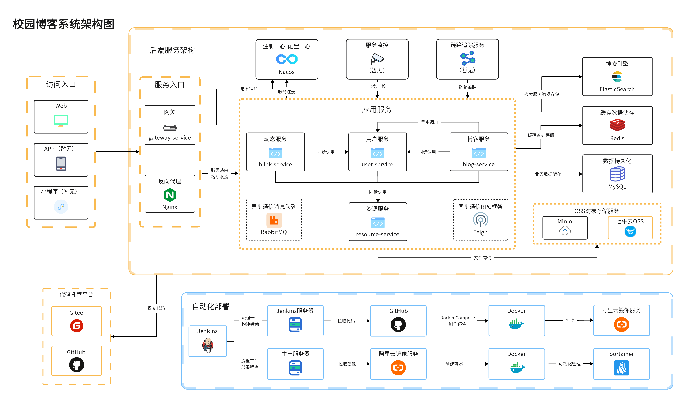
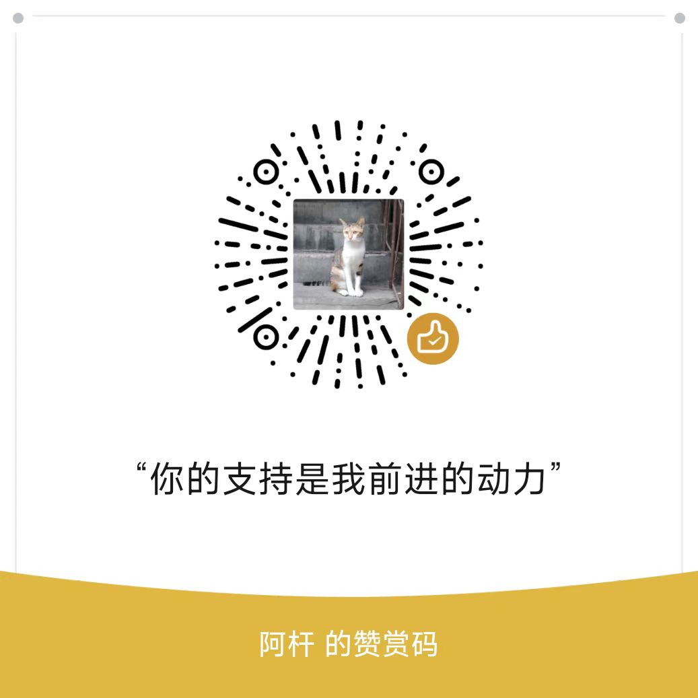

# 校园博客 [scblogs]

<p align=center>
  <a href="http://www.scblogs.cn">
    
  </a>
</p>

<p  align=center>
   基于微服务架构的前后端分离的博客系统
</p>
<p align="center">
<a target="_blank" href="https://github.com/stick-i/scblogs">
  
  
  
<br>
  
  
  <br>
  
  
</a></p>

## 系统架构图

> GitHub点此 [链接](https://raw.githubusercontent.com/stick-i/scblogs/main/document/image/scblogs-framework.png) 查看大图，Gitee直接点图片就可以放大



## 参与贡献

陆续有一些开源贡献者愿意加入到这个项目当中了😁，为了便于大家参与贡献，我将项目计划做了一些整理，主要分为以下几个部分：

|         新功能或新模块         |  难度  |
| :----------------------------: | :----: |
| 对原来的模块进行完善及新增功能 | 看情况 |
|         管理员系统模块         |  中等  |
|            问答模块            |  简单  |
|            商城模块            |  中等  |
|             OJ模块             |  困难  |

另外详细的计划内容已经作为issue发在GitHub上了，访问链接：https://github.com/stick-i/scblogs/issues/64 即可查看，欢迎大家参与噢！

在参与项目贡献前，请先阅读 [CONTRIBUTING](./CONTRIBUTING.md) 这个文件，这很重要。

如果你经常性的无法访问GitHub，这篇文章或许可以帮到你：[GitHub连接不上解决方案](https://juejin.cn/post/7158258577113612302)。

## 项目地址

项目部署在腾讯云服务器上，代码托管在 **Gitee** 和 **GitHub** 上，欢迎大家 **Star**

- 项目主页：http://scblogs.cn/
- Gitee地址：https://gitee.com/sticki/scblogs
- GitHub地址：https://github.com/stick-i/scblogs
- QQ交流群：729931395 <a target="_blank" href="https://qm.qq.com/cgi-bin/qm/qr?k=KwCs7qjv8N65wHys9A1nT8yZwfQF4oHh&jump_from=webapi&authKey=pk46Kps4/87pOQAWXQ+QcdHs31ZrGn+3/E/wBcxPEJrT/EkON/P6knYvUUDIexue"></a>
- 微信交流群：加我微信 **sticki6**，备注或私聊 “校园博客”，我拉你进群
- 腾讯云服务器购买链接：[云服务器等爆品抢先购，低至4.2元/月](https://cloud.tencent.com/act/cps/redirect?redirect=2446&cps_key=01c7d20caadfac8f61a2901a9324068c&from=console)
- 阿里云服务器购买链接：[云服务器精选特惠](https://www.aliyun.com/daily-act/ecs/activity_selection?userCode=dv0atr82)

## 项目特点

- 微服务架构开发，友好的代码结构及注释，便于阅读及二次开发
- 前后端分离，通过 **Json** 进行数据交互，前端无需关注后端技术
- 采用 **Nacos** 作为服务注册中心，支持分布式集群架构，方便微服务配置管理
- 采用 **Getaway** 搭建网关服务，进行负载转发的同时对用户身份进行识别，并支持配置接口未认证拦截功能
- 采用 **JWT** 的方式进行用户鉴权，配合网关服务保证其他所有微服务都能准确识别用户身份
- 采用 **Minio** 搭建对象存储服务，同时引入七牛云对象存储
- 采用 **AOP** + 自定义注解 + **Redis** 实现限制IP接口访问次数
- 基于 **Redis** 实现的分布式全局唯一ID生成器，保障ID可用性、安全性。
- 页面交互使用 **Vue2.x**，极大的提高了开发效率

## 项目目录

```
├─config：全局配置文件目录
├─document：项目文档目录
├─common：公用模块
│  ├─common-amqp：公用AMQP模块
│  ├─common-core：核心模块
│  ├─common-redis：公用Redis模块
│  ├─common-regex：公用正则模块
│  ├─common-tool：公用工具模块（需要修改或调整）
│  └─common-web：公用web模块
├─gateway-service：网关服务
├─user-service：用户服务
├─blog-service：博客服务
├─blink-service：动态服务
├─comment-service：评论服务
├─resource-service：资源服务
└─vueblog：前端Vue服务
```

## 技术选型

### 后端技术

|      技术      |       说明       |                        官网                         |
| :------------: | :--------------: |:-------------------------------------------------:|
|   SpringBoot   |     MVC框架      |      https://spring.io/projects/spring-boot       |
|  SpringCloud   |    微服务框架    |     https://spring.io/projects/spring-cloud/      |
|    Gateway     |   网关服务框架   |  https://spring.io/projects/spring-cloud-gateway  |
|     Fegin      |     RPC框架      | https://spring.io/projects/spring-cloud-openfeign |
|     Nacos      |  注册、配置中心  |              https://nacos.io/zh-cn/              |
|  MyBatis-Plus  |    数据库框架    |             https://mp.baomidou.com/              |
|     MySQL      |      数据库      |              https://www.mysql.com/               |
|     Redis      |    分布式缓存    |                 https://redis.io/                 |
|    RabbitMQ    |     消息队列     |             https://www.rabbitmq.com/             |
| Elasticsearch  |     搜索引擎     |     https://github.com/elastic/elasticsearch      |
|     Docker     |    容器化部署    |              https://www.docker.com/              |
|    Jenkins     |  自动化部署服务  |              https://www.jenkins.io/              |
|     Druid      |   数据库连接池   |         https://github.com/alibaba/druid          |
|     七牛云     |      七牛云      |   https://developer.qiniu.com/sdk#official-sdk    |
|     SLF4J      |     日志框架     |               http://www.slf4j.org/               |
|     Lombok     | 简化对象封装工具 |      https://github.com/rzwitserloot/lombok       |
|     Nginx      |    web服务器     |                 http://nginx.org/                 |
|     Hutool     |  Java工具包类库  |             https://hutool.cn/docs/#/             |
|     Minio      | 本地对象存储服务 |                  https://min.io/                  |
| Docker Compose |  Docker容器编排  |         https://docs.docker.com/compose/          |

### 前端技术

#### 前端运行
**1、安装node.js**
参考菜鸟教程：https://www.runoob.com/nodejs/nodejs-install-setup.html

**2、运行前端项目**
```shell

# 进入到前端项目目录
cd vueblog

# 强烈建议不要用直接使用 cnpm 安装，会有各种诡异的 bug，可以通过重新指定 registry 来解决 npm 安装速度慢的问题。
npm install --registry=https://registry.npmmirror.com

# 本地开发 启动项目
npm run serve
 
```
打开浏览器输入
http://localhost:8080/

## 赞助

如果本项目对你有帮助，可以请作者喝杯奶茶（超爱）！

| ☕️微信赞赏                                               | ☕️支付宝赞赏                                          |
|------------------------------------------------------|--------------------------------------------------|
|  |  |
