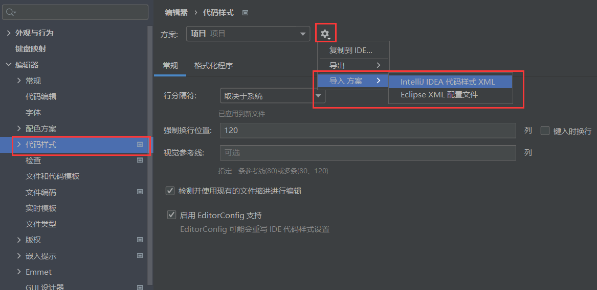
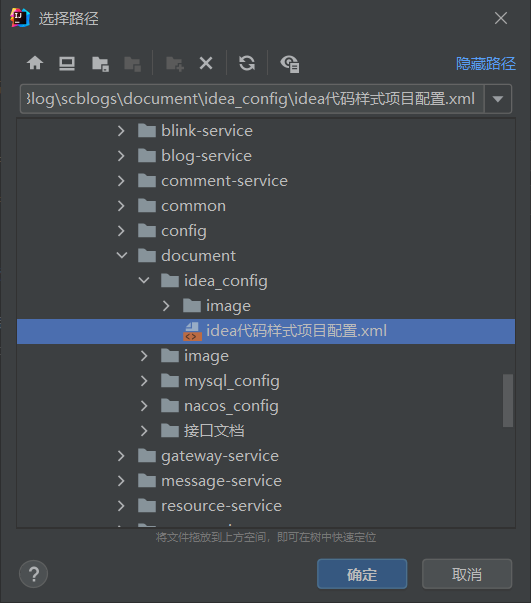
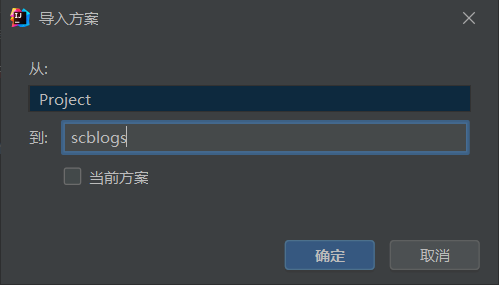
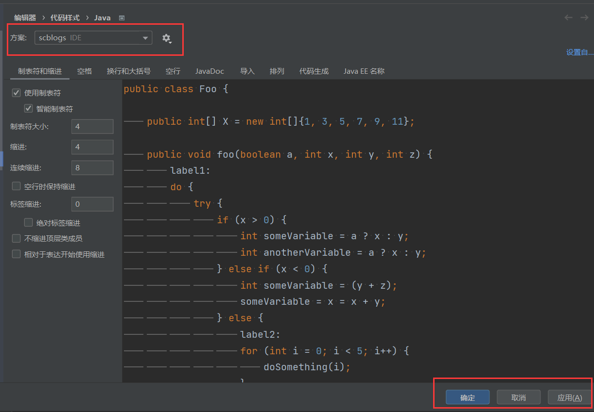
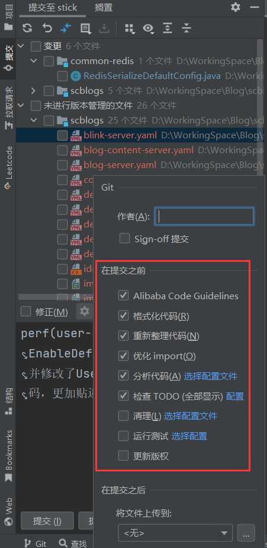

# idea配置文件使用说明

## 代码样式导入说明

打开设置 -> 代码样式 -> 设置 -> 导入方案 -> IDEA代码样式XML，如下图：

选择文件所在的路径，点击确定，如下图：

然后会弹出新的窗口，设置方案名称Project，或者叫scblogs也可以，如下图：

最后把方案设置成我们刚刚导入的，点击应用、再点击确定（还没结束）：

写代码的时候，我们只需要注意随处使用快捷键 **ctrl + alt + L** ，让idea自动帮我们完成排版就好了。这个快捷键使用不了的同学，可能是由于跟输入法的快捷键冲突导致的，随便修改其中一个就可以啦！

最后，我们还可以在git的设置中勾选上这些代码清理和格式化的设置，这样每次在提交的时候，idea会自动帮我们把要提交的文件都进行一次扫描清理，避免我们出现遗漏。把这些设置全部搞定，就很完美了！🥰

