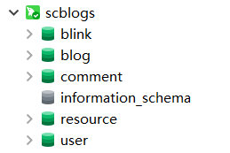

# SQL文件使用说明

校园博客数据库当前共有5个（图中绿色的五个），均对应了一个微服务。

你只需复制 `create_scblogs.sql` 文件中的内容，并在你自己的数据库中运行即可。

这份SQL文件会帮你完成这些事情：
- 创建database（如果存在则删除原来的）
- 创建table（如果存在则删除原来的）
- 填充一些基本数据和一些用户数据

创建后会有两个默认用户：

| 用户名  |  密码   |
| :-----: | :-----: |
|  stick  | scblogs |
| scblogs | scblogs |

# 其他

如果你将来提交的代码中有包含数据库更改的操作，请在 SQL 文件中也进行相应的修改且一并提交。