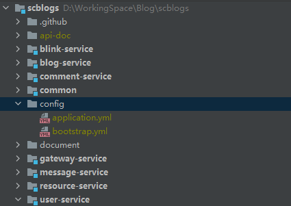
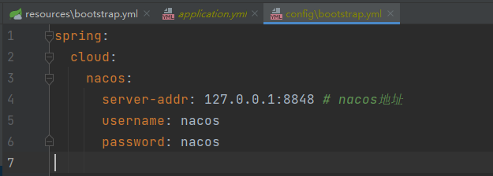

# Nacos配置文件使用说明

## 操作步骤

1. 将该目录下的`DEFAULT_GROUP`文件夹进行压缩，注意压缩格式必须是zip
2. 登录自己的Nacos后台，进入配置管理
3. 点击导入配置，注意目标空间必须是public
4. 将刚刚打包好的`DEFAULT_GROUP`文件进行上传，导入完成

## 关于配置

由于配置文件中有许多账号密码等敏感信息文件，所以我对他们进行了替换，全部修改为了xxxx，或者是默认配置。

需要开发者们根据自己的实际情况，在Nacos中将配置内容改为自己的账号密码

## 关于快速修改本地服务的Nacos连接信息

我们在使用的时候会发现，每个服务都需要配置本地Nacos地址，以及账号密码，这也是一件比较麻烦的事情。 而我的解决方案是，使用一个可以被所有项目都识别到的配置文件。

我们可以在根目录下创建一个config文件夹，然后在该文件夹下放一个`application.yml`和`一个bootstrap.yml`，就像这样：

要知道，这两个配置文件的加载优先级是非常高的，而且他们可以被其他所有的服务识别到（因为他们都在同一个大的文件夹下）。所以我们就可以把nacos的配置写在`bootstrap.yml`文件里，像这样：

包括一些其他需要被全局识别的配置，都可以放在这两个公共的配置文件里。比如日志级别，我设置为`debug`，并将放到了`application.yml`中。

最后，这个文件夹已经被我放到`.gitignore`文件当中了，默认是不会被git提交的，当然，我还是建议你在第一次提交前看一眼提交的文件，防止意外发生。
